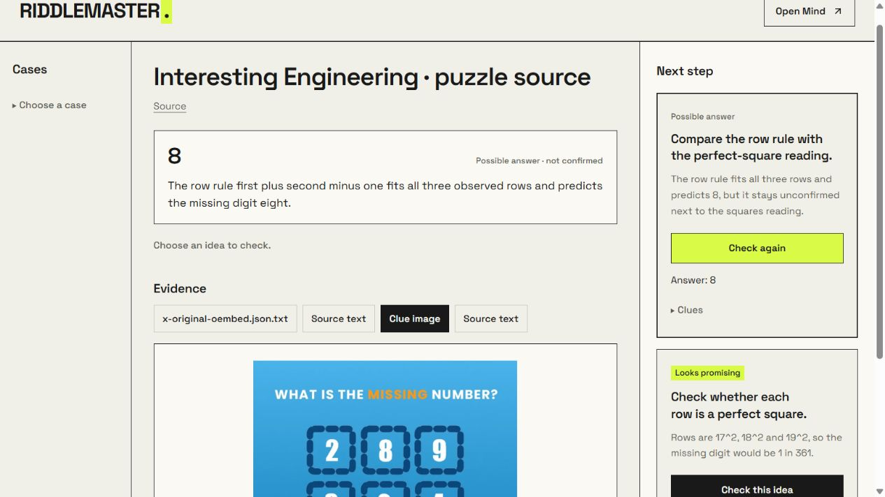

# Riddlemaster

An AI investigation partner for ARGs and linked puzzles, built with HelloMinds.

Send a puzzle link, text or image to your Mind. Riddlemaster saves the clues, tries ideas and shows its findings in a web workspace. Pick an idea to check, and the same Mind continues the investigation.

[Try the hosted preview](https://riddlemaster.vercel.app/). HelloMinds sign-in and Mind creation are verified. Automatic Skill setup and the full cloud investigation flow are not yet verified.

[Watch the demo](https://github.com/dnlvskey/riddlemaster/blob/main/docs/demo/riddlemaster-demo.mp4)



## How it works

1. Send a clue in the native HelloMinds chat.
2. Open the investigation link to see evidence and possible answers.
3. Click **Check this idea** to explore a branch.

Your clues and progress stay saved. A possible answer is labelled as unconfirmed until there is evidence that verifies it.

## Run locally

You need **Node.js 24+**, a HelloMinds account and your own Builder API key.

```sh
git clone https://github.com/dnlvskey/riddlemaster.git
cd riddlemaster
npm ci
```

Copy `.env.example` to `.env` and add your Builder API key. Keep the key private.

```sh
npm start
```

Open **http://127.0.0.1:4317**. To let your Mind investigate puzzles, follow the short [connection guide](docs/setup.md).

## What this version includes

- Website and image links, plain text, and TXT/PNG/JPEG/WebP attachments.
- Saved clues, text decoding, image experiments and alternative hypotheses.
- Interactive next steps, checkpoints and preserved attempt limits.

The local version uses your Builder API key. The hosted preview uses HelloMinds sign-in and private account workspaces.

See [demo notes](docs/demo/README.md) for the example and its limitations.
